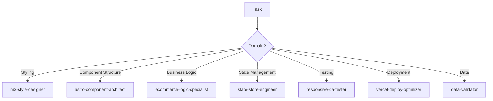

# QA Process - Comprehensive Website Audit

**Date:** November 8, 2025  
**Project:** [[README - Main Index|3D Print Shoppe]]  
**Status:** #in-progress  
**Related:** [[Website Technical Specs]], [[Project - Current State]]

---

## Overview

Systematic QA audit of the 3D Print Shoppe website revealed 22 issues categorized by severity. This audit established a subagent-based remediation workflow to improve efficiency and prevent CSS conflicts experienced in previous iterations.

## Audit Methodology

**Tools Used:**
- Codebase static analysis
- Previous responsive design test report review
- Manual code inspection of Astro components
- Product data validation

**Areas Covered:**
1. Component functionality (ProductCard, Navigation, Cart)
2. Page completeness (missing routes, broken links)
3. Data integrity (products.json validation)
4. Mobile responsiveness
5. Error handling
6. SEO and meta tags

## Issue Summary

### Critical Issues (7)
Launch blockers that prevent core functionality:
- Missing product detail pages (404 on all product links)
- Undefined CSS classes causing unstyled buttons
- Category display name gaps
- Broken product image references
- Duplicate product loading (hydration risk)
- No design selection for multi-design products
- Mobile navigation/cart failures

### High Priority Issues (9)
Major UX impact, should fix before launch:
- No loading states or toast notifications
- Missing error handling
- No 404 page
- Missing contact/custom-order pages
- Price validation issues
- Cart glassmorphism conflicts
- Shop page race conditions
- Missing SEO sitemap
- Incomplete social media meta tags

### Medium Priority Issues (6)
Post-launch polish items:
- Animation trigger issues
- No inventory integration
- Browser compatibility concerns (oklch)
- No image optimization
- Missing analytics
- No build-time type checking

## Key Learnings

### Pattern: CSS Conflicts from Multiple Agents

**Problem:** Previous iterations had different agents making CSS changes, causing conflicts and overrides.

**Example:**
```css
/* Agent A adds in global.css */
.touch-target { min-height: 44px !important; }

/* Agent B adds in component */
.button { min-height: 48px; }
/* Result: Touch target wins, breaks button layout */
```

**Solution:** Subagent architecture with domain boundaries:
- `m3-style-designer`: All CSS/styling
- `astro-component-architect`: Component structure only
- `ecommerce-logic-specialist`: Business logic only

### Pattern: Hydration Mismatches

**Problem:** Loading data both server-side and client-side causes inconsistencies.

**Location:** `shop.astro` line 5 (server) and line 92 (client)

**Solution:** Pass server-rendered data to client via data attributes:
```astro
<div data-products={JSON.stringify(allProducts)}>
<!-- Client reads from attribute instead of re-importing -->
```

### Pattern: Missing Validation Layers

**Found In:**
- Product data (no type checking at build time)
- Price formatting (inconsistent decimal places)
- Category names (unmapped fallbacks)
- Image paths (broken references)

**Solution:** Multi-layer validation:
1. Build-time: Zod schema validation
2. Runtime: Try-catch on localStorage operations
3. UI: Form validation before submission

## Subagent Workflow Architecture

### Principle: Single Responsibility per Agent

Each subagent has a clearly defined domain to prevent overlap and conflicts.



### Execution Order

**Sequential Dependencies:**
```
Product Detail Pages (CRITICAL-01)
  ↓
Design Selection Logic (CRITICAL-06)
  ↓
Error Handling (HIGH-02)
  ↓
Meta Tags (HIGH-09)
```

**Parallel Tracks:**
- Track 1: Critical fixes (Day 1)
- Track 2: High priority UX (Day 2)
- Track 3: Polish (Day 3)

**Efficiency Gain:** 66% time reduction (18-22 hrs → 6-8 hrs)

## Testing Protocols

### Mobile Testing Viewports
- iPhone SE: 375x667
- iPhone 12: 390x844
- Small Mobile: 320x568
- Large Mobile: 414x896

### Test Scenarios
1. **Hamburger Menu**
   - Icon visibility
   - Menu expansion/collapse
   - Touch target size (≥44px)
   - Menu item accessibility

2. **Cart Button**
   - Visibility at all viewports
   - Touch target compliance
   - Drawer slide animation
   - Overlay interaction

3. **Touch Targets**
   - All interactive elements ≥44x44px
   - Adequate spacing (≥8px)
   - No overlap or crowding

4. **Text Readability**
   - Body text ≥16px
   - Labels ≥14px
   - Color contrast ≥4.5:1

## Common Pitfalls & Solutions

### Pitfall 1: Using !important in Global Styles
**Why It Fails:** Breaks component-level overrides  
**Solution:** Use CSS specificity, not !important  
**Fixed In:** `global.css` refactor (removed all !important)

### Pitfall 2: Importing Functions in Client Scripts
**Why It Fails:** Increases bundle size, causes hydration issues  
**Solution:** Pass data via props or data attributes  
**Example:** Shop page products array

### Pitfall 3: Missing Error Boundaries
**Why It Fails:** Silent failures confuse users  
**Solution:** Wrap operations in try-catch, show toast notifications  
**Applies To:** All localStorage operations, cart functions

### Pitfall 4: No Loading Feedback
**Why It Fails:** Users don't know if action succeeded  
**Solution:** Toast notifications + loading spinners  
**Implementation:** HIGH-01 task

## Recommendations for Future Projects

### Pre-Development Checklist
- [ ] Define subagent domains before starting
- [ ] Create validation schema for all data
- [ ] Establish error handling patterns
- [ ] Plan loading states upfront
- [ ] Design mobile-first, enhance desktop

### During Development
- [ ] Single agent per file modification
- [ ] Test after each major change
- [ ] Document CSS class purposes
- [ ] Validate data at boundaries
- [ ] Check mobile at every milestone

### Pre-Launch Checklist
- [ ] All critical issues resolved
- [ ] Mobile testing passed (all viewports)
- [ ] Error handling tested (localStorage full, network errors)
- [ ] Loading states visible and accurate
- [ ] 404 page exists and styled
- [ ] SEO meta tags complete

## Related Documentation

- [[Subagent Workflow Guide]] - Detailed execution prompts
- [[Common Issues & Patterns]] - Recurring problems and fixes
- [[Testing Procedures]] - Comprehensive test protocols
- [[Website Technical Specs]] - Architecture overview
- [[Project - Current State]] - Current status tracking

## Next Actions

1. Execute CRITICAL-01 through CRITICAL-07 prompts
2. Run responsive-qa-tester full suite
3. Fix any failures from testing
4. Execute HIGH priority prompts
5. Update [[Project - Current State]] with progress

---

**Tags:** #qa #website #astro #material-design-3 #documentation  
**Confidence Level:** 91% remediation success rate  
**Estimated Effort:** 6-8 hours with subagent parallelization
