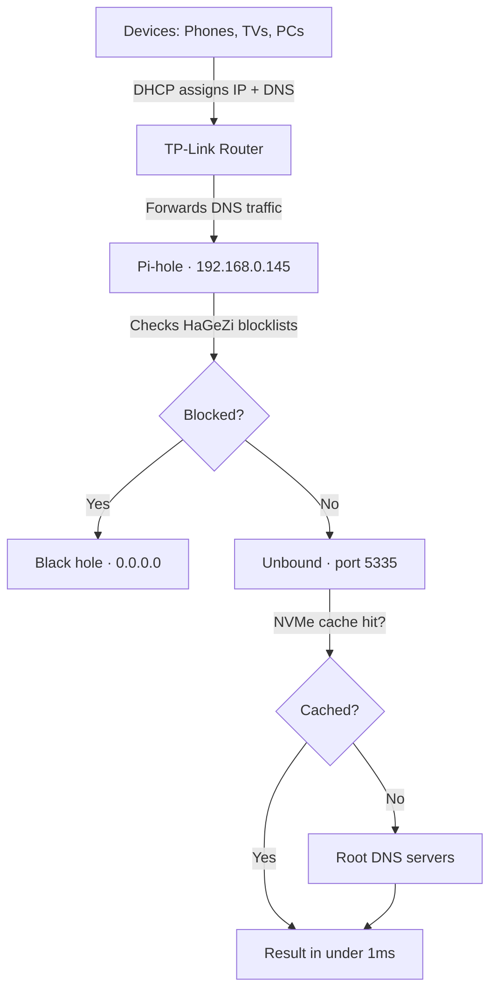

# Pi-hole Migration: RPi B+ → RPi 5 NVMe

> [!abstract] TL;DR
> Moved the home network's DNS brain off a dying Raspberry Pi B+ (SD card, 512MB RAM) onto a Raspberry Pi 5 4GB booting entirely off PCIe NVMe. Brought Unbound along for the ride for recursive DNS privacy. Broke the internet twice in the process. Fixed it. Everything's faster and more private now.
>
> **Where this came from:** [[Pi-hole Setup Guide - Complete Journey]] — the original B+ setup
> **Where the RPi 5 lives:** [[Project Overview - NOC Skills Homelab]]

---

## Why migrate?

The B+ was running hot on a dying SD card at 512MB RAM. The RPi 5 was already the NOC box running Docker and monitoring services — centralizing DNS there made sense. Faster hardware, NVMe reliability, one machine to maintain.

| | Raspberry Pi B+ | Raspberry Pi 5 4GB |
|---|---|---|
| RAM | 512MB | 4GB |
| Storage | SD Card (dying) | PCIe NVMe SSD |
| CPU | ARMv6 700MHz | ARM Cortex-A76 2.4GHz |
| Role before | Pi-hole only | NOC monitoring stack |
| Role after | Retired | Pi-hole + full NOC stack |

---

## Phase 1 — Flash the RPi 5 (NVMe, no GUI)

> [!info] Why not clone the old SD card?
> Cloning a potentially corrupt SD card onto a fresh NVMe just drags the old problems along. Fresh OS install + Teleporter restore is the cleaner path every time.

**OS:** Raspberry Pi OS Lite (Debian Trixie, 64-bit, arm64)

```bash
# Flash directly to NVMe — no SD card involved
xzcat 2025-12-04-raspios-trixie-arm64-lite.img.xz | sudo dd of=/dev/nvme0n1 bs=4M status=progress conv=fsync
```

**Headless SSH setup** — mount the boot partition and create two files before first boot:
- Empty file named `ssh` → enables the SSH service on boot
- File named `userconf` containing `username:encrypted_password` → creates your user

**Unlock PCIe Gen 3 speeds** — edit `/boot/firmware/config.txt`:

```text
dtparam=pciex1
dtparam=pciex1_gen=3
```

> [!warning] Gotcha — SSH host key conflict
> Mac throws `WARNING: REMOTE HOST IDENTIFICATION HAS CHANGED!` because it remembers the old Pi's fingerprint at that IP.
>
> **Fix:** `ssh-keygen -R 192.168.0.145`

---

## Phase 2 — Pi-hole via Teleporter

Smoothest part of the whole migration.

```bash
curl -sSL https://install.pi-hole.net | bash
```

After install: Pi-hole GUI → **Settings → Teleporter** → upload the `.tar.gz` backup from the B+.

Done. All local DNS entries, blocklists, and settings restored instantly. The Teleporter backup is worth its weight in gold — make one before any migration.

---

## Phase 3 — Unbound (Recursive DNS)

Instead of forwarding DNS queries to Google or Cloudflare, Unbound queries root internet servers directly. No third party ever sees what you're looking up.

```bash
sudo apt install unbound
```

Config lives at `/etc/unbound/unbound.conf.d/pi-hole.conf` — set it to listen on port `5335`.

> [!danger] Gotcha — Unbound silently fails to start on Trixie
> Debian Trixie ships `unbound-resolvconf.service` which conflicts with Unbound at startup. The service fails silently — no obvious error, it just doesn't run. Most Unbound guides are written for older Debian and don't mention this at all.

> [!success] Fix
> ```bash
> sudo systemctl disable --now unbound-resolvconf.service
> sudo service unbound restart
> ```

**Wire Unbound to Pi-hole:**
Pi-hole GUI → Settings → DNS → uncheck all upstream providers → Custom IPv4: `127.0.0.1#5335`

**Test it first:**
```bash
dig google.com @127.0.0.1 -p 5335
# Should return NOERROR in the status line
```

---

## Phase 4 — Breaking the DNS Loop

This was the painful one.

> [!danger] The Loop of Death
> **Router → Pi-hole → Router → Pi-hole → ...**
>
> The router points DNS traffic to Pi-hole. Pi-hole asks the router to resolve upstream. The router points back to Pi-hole. Nothing ever resolves. ~30 queries fire in, zero responses come out. Internet fully dead.

### Fix Part 1 — Force the Pi to use its own Unbound locally

```bash
sudo nano /etc/resolv.conf
# Change the nameserver line to:
nameserver 127.0.0.1

pihole restartdns
```

### Fix Part 2 — TP-Link router DHCP settings

Navigate to: **Advanced → Network → DHCP Server**

| Setting | Value | Why |
|---|---|---|
| Primary DNS | `192.168.0.145` (RPi 5) | Routes all device DNS through Pi-hole |
| Secondary DNS | *leave completely blank* | Prevents devices from silently bypassing Pi-hole |
| Address Reservation | Bind Pi's MAC → `.145` | IP never shifts on reboot |

> [!warning] Do not set a Secondary DNS
> Setting `1.1.1.1` or `8.8.8.8` as a fallback means devices will quietly use it whenever Pi-hole is "slow" — which defeats the entire point. Leave Secondary blank.

---

## Phase 5 — Blocklists (2026 Stack)

Network-wide ad and telemetry blocking without needing uBlock Origin on every device.

**Add in Pi-hole → Adlists:**

```
# Main ad/tracker block
https://cdn.jsdelivr.net/gh/hagezi/dns-blocklist@latest/adblock/pro.txt

# Malware + phishing threat intel
https://cdn.jsdelivr.net/gh/hagezi/dns-blocklist@latest/adblock/tif.txt

# Microsoft telemetry (Windows phones home aggressively)
https://cdn.jsdelivr.net/gh/hagezi/dns-blocklist@latest/adblock/native.windows.txt
```

**Anti-snoop regex** (Pi-hole → Domains → RegEx) — catches dynamic subdomains from smart TVs and big tech:

```regex
(^|\.)(telemetry|stats|analytics|metrics|metrics-config|tracker|survey|log|diag|vortex|asimov)\.(apple|google|microsoft|samsung|amazon|fb|facebook|netflix|lgsmartad)\.com$
```

Run `pihole -g` after adding lists to update gravity.

---

## Final Architecture



---

## Quick Reference

| Problem | Fix |
|---|---|
| SSH throws host key warning | `ssh-keygen -R <pi-ip>` |
| Unbound won't start (Trixie) | `sudo systemctl disable --now unbound-resolvconf.service` |
| Internet dead after setup | `sudo nano /etc/resolv.conf` → `nameserver 127.0.0.1` |
| Devices bypassing Pi-hole | Leave Secondary DNS blank in router DHCP |
| Pi-hole IP keeps shifting | Set DHCP address reservation by MAC in router |
| DNS not resolving via Unbound | `dig google.com @127.0.0.1 -p 5335` to test directly |
| Pi-hole not getting queries | Check Pi-hole dashboard — confirm clients are listed |

---

## Key Lessons

> [!tip] What this migration taught
> 1. **DNS loops are silent killers** — nothing breaks at setup, only explodes when the network tries to resolve something
> 2. **Teleporter is irreplaceable for migrations** — back it up before touching anything
> 3. **Debian Trixie has breaking changes for Unbound** that older guides don't cover
> 4. **Never set a secondary DNS** unless it's also your Pi-hole — it silently bypasses your filtering
> 5. **MAC-based IP reservation is non-negotiable** for infrastructure — one DHCP hiccup and the whole stack breaks

---

*Migration completed: March 2026*
*Hardware: Raspberry Pi 5 4GB · PCIe NVMe SSD*
*Final config: Pi-hole + Unbound + HaGeZi blocklists + regex filters*
*Related: [[Pi-hole Setup Guide - Complete Journey]] · [[Pi-hole TrueNAS Network Conflict Troubleshooting]]*
