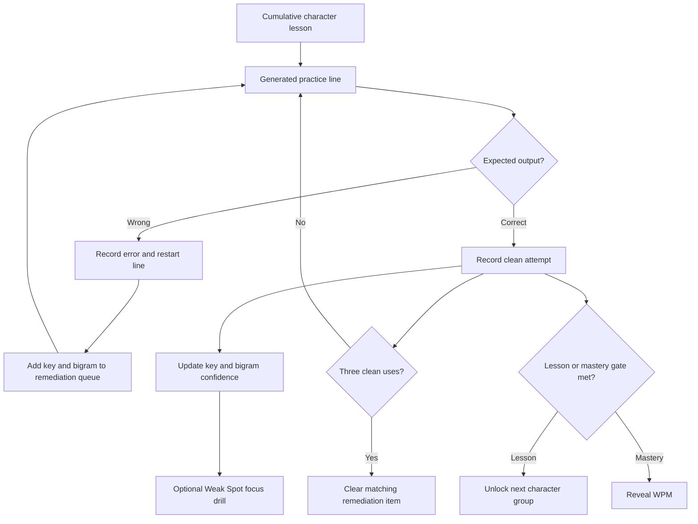

# Technical Architecture and Product Record

## Repository Map

| File | Responsibility |
|---|---|
| `profile.js` | Physical slots, base/number outputs, lessons, required outputs |
| `core.js` | Progress normalization, attempts, remediation, generators, confidence, mastery, backup parsing |
| `app.js` | Browser state, rendering, input events, editor, focus drills, persistence, PWA registration |
| `index.html` | Accessible product structure and dialogs |
| `styles.css` | Catppuccin Macchiato and Very Peri visual system, Corne geometry, responsive layout |
| `sw.js` | Offline app-shell cache |
| `manifest.webmanifest` | Install metadata and PWA icons |
| `test/core.test.js` | Logic, migration, timing, analytics, focus, mastery, and backup regressions |
| `scripts/build.mjs` | Copies the static client and emits the Sites worker entrypoint |

## Current Learning Flow



## Keyboard Contract

- Hardware shape: Corne v4.1, `LAYOUT_split_3x6_3_ex2`, 46 slots.
- Base layout: Colemak-DH Matrix as captured in `profile.js`.
- Number drills target Layer 3.
- Layer 3 is held from `r-t-middle`, whose base action is `Space` and hold label
  is `LT 3`.
- Digits use the middle row as `1–5` on the left and `6–0` on the right.
- UI chord labels use forms such as `L3 + 4`. Timing describes the digit event
  delivered by the browser, not the physical thumb press.

## Progress and Analytics

`TrainingProgress` version 2 preserves lifetime output counters, recent
accuracy windows, the remediation queue, clean-line streaks, mastery, post-
mastery speed lines, and up to 2,000 attempt records.

Each retained attempt may contain:

- mode;
- expected and actual output;
- correctness;
- timestamp;
- previous expected output;
- nullable transition latency.

Key and bigram confidence use the latest 30 relevant samples. The score is
sample coverage multiplied by a blend of 75% accuracy and 25% relative
transition consistency. Fewer than five samples display **Collecting data**.
Timing is ignored at line starts, after restarts, after refocus or visibility
loss, and after pauses over two seconds.

## Persistence Contract

- Profile key: `corne-accuracy.profile.v1`
- Progress key: `corne-accuracy.progress.v1` containing normalized v2 data
- Backup export version: 2
- Accepted backup versions: 1 and 2
- History limit: 2,000 attempts
- Speed line limit: 20
- No account, backend, telemetry, or cloud progress sync

Changing an output removes analytics only for that output and transitions that
depend on it, resets the relevant clean streak, and relocks mastery. Unrelated
output history survives.

## Verification Commands

```bash
cd "/Users/aim/Documents/Corne Accuracy Trainer"
npm test
npm run build
npm start
```

Current automated baseline: 16 passing tests at commit `df76c22`.

## Deployment Record

- GitHub: private `AIMDaAlien/aim-corne-accuracy-trainer`
- Default branch: `main`
- Sites project metadata: `.openai/hosting.json`
- Sites source remote: `sites`
- Private deployment: https://corne-accuracy-trainer.aliennerd8988.chatgpt.site
- Current documented release: Sites version 4 from `df76c22`

Do not call the private deployment broken when an unauthenticated request
returns HTTP 401. Verify from an authenticated owner browser, deployment state,
and worker logs.
