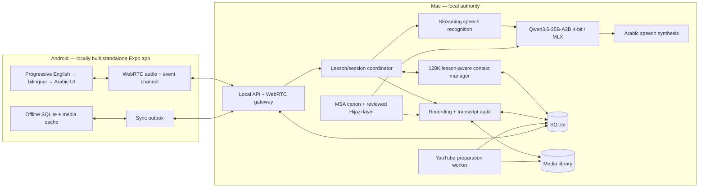

# Architecture and Implementation Plan

## Approved Outcome

Build an Android-first, private language tutor. The Mac performs inference,
speech processing, memory, auditing, and authoritative storage. The phone is a
fast conversation surface with a deliberate offline cache.

Arabic ships first. MSA is canonical. Reviewed Hijazi alternatives may be shown
for conversational usefulness. Japanese follows only after the Arabic pipeline
and synchronization are stable.

## Architecture



## Context and Durable Memory

The model may use at most **128K active tokens**. A session is assembled from:

1. short tutor policy and language policy;
2. current lesson objective and approved vocabulary;
3. recent verbatim turns;
4. compacted lesson episodes relevant to the objective;
5. explicit learner memory, corrections, and approved cards.

Token thresholds:

- Under 80K: keep recent turns verbatim.
- At 80K: compact the oldest completed lesson segment into a durable episode.
- At 112K: block the next model turn until enough completed segments are
  compacted.
- At 128K: reject the request safely; never truncate policy or the current
  learner turn.

An episode records its source turn range, objective, vocabulary, recurring
errors, corrections, learner preferences, and a factual summary. Compaction is
append-only and idempotent. Source recordings and transcripts remain auditable.

The hybrid Qwen architecture has had long-context and prefix-cache issues in
MLX. Therefore a successful 128K prefill under the 36 GB allowance is a Phase 1
gate. Configuration metadata alone is not proof.

## Resource Budget

The complete host application may use at most **36 GB resident memory**:

| Area | Working ceiling |
|---|---:|
| Qwen3.6 4-bit model weights | 20 GB |
| Model state and active context | 10 GB |
| Speech models and audio buffers | 3 GB |
| API, SQLite, indexes, and workers | 2 GB |
| Safety margin inside allowance | 1 GB |

These are operational ceilings, not reservations. A benchmark records peak
resident memory, prefill latency, first-token latency, and decode rate. MTP is
off by default and is enabled only if it improves latency without reducing
Arabic quality or exceeding the budget.

## Arabic Policy

- Tutor explanations and formal examples use MSA.
- Hijazi forms are labeled, never presented as formal MSA.
- Only reviewed Hijazi entries may enter prompts or approved cards.
- An unreviewed model suggestion is stored as a suggestion, not as truth.
- Arabic text, punctuation, numerals, selection, and mixed-script layouts must
  work in RTL.
- Review compares recording, transcript, MSA correction, Hijazi alternative,
  confidence, and source lesson before approval.

## Interface

Direction: a dark, focused listening room rather than a generic dashboard.

- Very Peri is the dynamic session color, not a purple-on-white gradient.
- Near-black indigo surfaces, readable warm-white Arabic, and one warm accent.
- Restrained glassmorphism on the live transcript and transport dock only.
- Large Arabic type, explicit RTL lesson regions, directional isolation for
  mixed Arabic/English text, and minimum 44-point touch targets.
- Live state is unmistakable: listening, thinking, speaking, paused, offline.
- Motion is short and functional; reduced-motion settings are honored.
- Recordings, suggestions, approvals, sync state, and destructive actions are
  explicit.
- Android hides the status bar during use. The navigation bar remains available
  so the app does not trap a new learner in an unfamiliar full-screen gesture.

### Progressive interface language

The application shell must not begin as an Arabic-only test. It advances through
four reversible stages:

1. **Trailhead — English:** English controls and guidance; Arabic lesson content
   remains correctly RTL and includes a small essential-word compass.
2. **Bridge — English + Arabic:** English leads; learned Arabic control words
   appear beside it.
3. **Guided Arabic — Arabic + English:** Arabic leads; English remains as rescue
   text.
4. **Immersion — Arabic:** Arabic controls lead, but the Guide always permits a
   manual step back.

Aim explicitly confirms each vocabulary bundle before the interface advances.
Automatic promotion may later use spaced-repetition mastery, but it must never
pretend that opening a screen proves understanding.

## Repository

```text
language-engine/
├── README.md
├── .env.example
├── apps/
│   ├── host/                 # Python API, WebRTC, model, lessons, sync
│   │   ├── language_engine/
│   │   └── tests/
│   └── mobile/               # Expo React Native Android-first client
├── packages/
│   └── protocol/             # Versioned JSON message schemas/fixtures
├── scripts/                  # Local proof commands
└── var/                      # Ignored SQLite, media, caches, reports
```

Avoid shared abstractions until both clients need them. The protocol package
contains data contracts only.

## Acceptance Tests

### Phase 1 gates

- Exact local model loads through MLX and answers an Arabic prompt.
- Model metadata and tokenizer accept a 128K request.
- A measured 128K prefill completes below 36 GB resident memory without
  destabilizing macOS.
- Context tests compact at 80K, force compaction at 112K, and never silently
  cross 128K.
- Durable lesson episodes survive process restart in SQLite.
- A physical Android Expo development build establishes WebRTC audio and data
  channels to the Mac over the LAN.

### Arabic live lesson

- Arabic speech becomes an incremental transcript.
- The tutor response streams as text and audio.
- Interruption stops playback and returns to listening.
- Reconnect preserves the lesson and does not duplicate a turn.
- MSA and reviewed Hijazi content are visibly distinct.
- Talk controls and mixed Arabic/Latin content work at Android phone widths.

### Audit and approval

- Every recording maps to its session, turn, transcript, and correction.
- Aim can replay audio, edit transcript/correction, approve, or reject.
- No suggestion becomes an approved card without an explicit approval event.
- Deleting media is confirmed and leaves a database audit event.

### Offline and expansion

- A downloaded lesson opens with the Mac unavailable.
- Offline work enters an idempotent outbox and syncs once after reconnection.
- Conflicts are exposed for review; host records are not silently overwritten.
- YouTube import stores provenance, prepared segments, and rights/availability
  state; it does not bypass access controls.
- Japanese uses a language pack and does not weaken Arabic RTL behavior.

## Implementation Phases

### Phase 1 — Compatibility and transport proof

1. Create the minimal monorepo and local configuration.
2. Load the exact 4-bit model and record model size and baseline Arabic output.
3. Benchmark optional MTP against the non-MTP path.
4. implement the lesson-aware 80K/112K/128K context policy and durable SQLite
   episodes.
5. Build the smallest Expo development client and prove Android WebRTC audio
   plus data-channel transport on a physical device.
6. Record pass/fail evidence. Do not begin speech product work until the model,
   memory ceiling, and transport gates are understood.

### Phase 2 — Arabic live agent and mobile shell

1. Add streaming Arabic ASR and TTS behind narrow provider boundaries.
2. Orchestrate listen → transcribe → tutor → speak, including interruption.
3. Persist lessons, turns, learner memory, and reconnect keys on the Mac.
4. Build the dark Very Peri glass shell with full RTL and accessible controls.
5. Verify on a physical Android phone under normal and degraded LAN conditions.

### Phase 3 — Audit, dialect suggestions, and cards

1. Save consented recordings and bind them to transcript spans.
2. Add the recording audit/replay screen.
3. Generate MSA corrections and candidate Hijazi alternatives.
4. Require human review for Hijazi entries and card creation.
5. Export only approved cards to spaced-repetition queues.

### Phase 4 — Preparation, offline sync, Japanese, hardening

1. Add provenance-preserving YouTube URL preparation for content Aim may use.
2. Add bounded mobile lesson/media downloads and an idempotent offline outbox.
3. Add conflict review, backup, restore, schema migration, and media integrity
   checks.
4. Add Japanese as a separate language pack.
5. Run privacy, security, battery, latency, packet-loss, storage, and recovery
   tests before treating the app as dependable.

## Current Phase

**Standalone Android and beginner UI proven — release hardening active**

Canonical repository: `/Users/aim/Documents/language-engine`

## Implementation Record — 2026-07-30

Implemented and proven on the Mac:

- MLX Whisper large-v3-turbo produces partial/final Arabic transcripts from
  WebRTC audio windows; the Arabic prompt correctly preserves Aim's name.
- Live speech events cover start, partial transcript, final transcript, tutor
  text deltas, final reply, interruption, and idempotent turn persistence.
- Arabic and Japanese tutor speech is delivered as short-lived signed PCM WAV.
- Recording consent is off by default. Consented turns map recording, learner
  turn, transcript, correction, review state, deletion event, and audit history.
- Pending Hijazi suggestions can be generated, reviewed, rejected, or explicitly
  approved as cards. Card creation remains impossible before review.
- The mobile cache stores lesson snapshots, queues offline work once, surfaces
  host/mobile review conflicts, and requires an explicit resolution.
- Rights-confirmed YouTube provenance can be paired with a local media copy and
  prepared into 30-second mono lesson segments. No access controls are bypassed.
- Backup, restore, SQLite integrity, media-path integrity, and checksum
  verification use local standard-library tooling with rollback artifacts.
- Japanese has its own tutor policy, ASR language, TTS voice, and explicit LTR
  content styles; the Arabic shell remains RTL.
- `/v1` APIs support a 32-character shared key. Media uses five-minute signed
  URLs so playback clients never place the host key in a URL.
- Browser proof at 375 px shows Arabic root/content as RTL and right-aligned,
  English translations as LTR, Japanese content as LTR, a clean console, and a
  working suggestion-to-card flow.

Implemented and proven on the physical Android target:

- OnePlus 12 (`CPH2583`) on Android 16 / API 36 installs the locally assembled
  APK and launches with Metro stopped and `adb reverse` removed.
- Tailscale Serve exposes only the local host service to the private tailnet at
  `https://macbook-pro.tail7124d6.ts.net/`.
- A real microphone turn completed WebRTC audio capture, MLX Whisper Arabic
  transcription, tutor response, signed WAV synthesis, and phone playback.
- Arabic content renders right-to-left on the phone; the Latin `MSA` label is
  directionally isolated.
- Expo OTA updates are disabled. The app does not need Expo's cloud build,
  deployment, or update services.
- Camera and Android overlay permissions are blocked.
- The Android status bar is hidden while the app is focused; the bottom system
  navigation gesture remains available.
- The whole application shell now starts in English and advances through
  Trailhead, Bridge, Guided Arabic, and Immersion. Interface stage persists in
  mobile SQLite and can always move backward.
- The recording-consent switch uses physical in-track positions independent of
  text direction. Its off and on states were both inspected on the OnePlus.
- The release APK was rebuilt, installed, and checked without Metro. TypeScript,
  Expo configuration, Android API 36 assembly, focus/full-screen state, and
  accessibility switch state all passed.

Still required before dependable-device status:

- Replace debug-certificate release signing with Aim's permanent release key.
- Provision the API key so Tailscale is not the sole application-level trust
  boundary.
- Run the Mac host as a resilient local service with startup and recovery.
- Prove interruption, reconnect, recording consent, and offline replay on the
  phone outside the successful baseline round trip.
- Run degraded-LAN, packet-loss, battery, thermal, and storage-pressure tests.
- Add bounded offline media downloads; the current mobile cache stores lesson
  snapshots and the idempotent operation outbox, not lesson audio.
- Attach accurate English meaning and transliteration to generated Arabic tutor
  replies; a static translation must never be shown for a different live reply.
