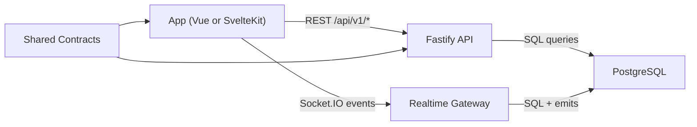

# Architecture in Plain English

The app's got four core pieces. Here's what they each do and how they talk to each other.

## The 4 core pieces

**`apps/mobile` (or `apps/web` in the PWA build)**
The actual UI users see. Handles login, chat screens, the offline queue, and the socket connection.

**`services/api`**
The backend brain. It validates auth, checks permissions, saves messages, and fires off realtime events.

**`packages/contracts`**
A shared rulebook — basically the types and schemas that both the app and the backend import. This is what keeps both sides in sync so a change in one doesn't silently break the other.

**PostgreSQL (the database layer)**
Stores users, invites, refresh tokens, chats, members, and messages. It's the final source of truth.

## How they talk

## What happens when you send a message

1. You type a message and hit send.
2. The app creates a `clientMessageId` and shows the message immediately (optimistic UI).
3. The app sends the message to the API and/or via a socket event.
4. The API verifies you're actually a member of that chat, then writes to the database.
5. The API emits `message.new` to the chat room and `message.ack` back to you specifically.
6. The app swaps the temporary local ID with the real server-side ID when the ack comes in.

## Why this setup stays stable

- **Contract-first** means both sides validate against the same schema. Nothing drifts silently.
- **DB uniqueness** on `(chat_id, sender_id, client_message_id)` prevents duplicate messages even if something retries.
- **Token rotation** keeps sessions safer and predictable.
- **Offline queue with retry** means the app survives network drops without losing messages.

## What breaks what

- Contracts break → app and backend start disagreeing, requests fail.
- Auth breaks → most routes and sockets go down.
- Dedup logic breaks → duplicate or lost messages under reconnect/race conditions.
- Reconnect logic breaks → app looks "offline" even after the server's back up.
