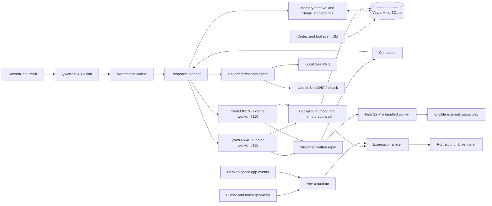

# Architecture and Implementation Plan

## System Flow

## Implemented Architecture

- `VeyraMindStore` is an actor owning one SQLite connection in WAL mode.
- Durable tables store messages, semantic memories, commitments, and 24-hour activity observations.
- `ResponsePlan.classify` chooses brief, normal, deep, creative, or research mode before inference.
- Visible prose streams first. Structured mood, memory, and commitment appraisal runs afterward.
- Nomic embeddings supplement lexical retrieval. Linear cosine search is intentional for a single-user database.
- `ResearchAgent` performs at most three search/evidence rounds and keeps at most eight sources.
- Immediate app events remain authoritative over model mood.
- Screen awareness is permission-gated. When enabled, a downscaled frame is sent to Qwen3.5-4B for a concise textual description; raw frames are never persisted and are never sent to Qwen3.8.
- Foreground-app and CLI work events enter the same activity ledger used by conversation context.

## Model Lanes

| Lane | Model | Endpoint | Notes |
|---|---|---|---|
| Brief, normal, proactive, visual awareness | `mlx-community/Qwen3.5-4B-MLX-4bit` | `127.0.0.1:8112` | Bundled MLX worker started, warmed, and terminated with Veyra |
| Deep, creative, research | `qwen3.8-27b-4bit` | `127.0.0.1:8110` | External Rapid-MLX service; Veyra checks and warns but does not manage it |
| Embeddings | Nomic Embed Text v1.5 as `veyra-embed` | `127.0.0.1:1234` | LM Studio remains embeddings-only |

- Bonsai is removed from the runtime. Conversation allowlisting accepts only the intended Qwen3.5-4B and Qwen3.8-27B runtime IDs; Heretic and legacy Qwen remain blocked.
- Research continues through `ResearchAgent`, using Qwen3.8 on `8110`.
- When a screenshot exists, Qwen3.5-4B writes a short factual screen description into `awarenessContext`. The image is not sent to Qwen3.8.
- Before `ResearchAgent.run`, Veyra shows a non-blocking warning: “Close heavy apps before research.”

## Bundled Speech Runtime

- TTS is enabled by default and limited to brief replies plus proactive check-ins. Normal, deep, creative, and research replies remain silent.
- `SpeechPolicy` keeps a mixed-language line whole and chooses Arabic → Japanese → English for the anchor voice.
- The bundled Fish S2 Pro worker maps `EN-H`, `JA-B`, and `AR-O` to their selected anchor WAVs and synthesizes the whole line in one pass.
- Audio playback is allowed only when CoreAudio reports an eligible external output. Built-in routes, including MacBook Pro Speakers, always fail closed.
- The worker is bundled under `Contents/Resources/SpeechWorker`; the model weights and Python environment remain in their existing external caches.
- Measured cold warm is about 3.3–3.9 seconds; warmed short replies are about 2.6–5.8 seconds at roughly 0.6× real time.
- The cached `mlx-community/fish-audio-s2-pro-8bit` was benchmarked on isolated port `8124`. It passed format, clipping, and speed checks, but failed the warm gate at `4.05s` versus the required `<= 3.5s`, so the default remains `mlx-community/fish-audio-s2-pro`.

## Response Budgets

| Mode | Normal behavior | Generation safety ceiling |
|---|---|---:|
| Brief | Greeting, acknowledgement, simple question | 384 |
| Normal | Ordinary conversation and coaching | 1,536 |
| Deep | Technical, résumé, review, substantial planning | 4,096 |
| Creative | Requested literary form and length | 8,192 |
| Research | Multi-round evidence synthesis | 8,192 |

These are safety ceilings, not target lengths. There is no universal 180-token cap.

## Remaining Phases

### Phase 1 — Live interface proof

- Packaged app installation and login startup are complete.
- Approve Screen Recording permission.
- Verify L01N8A exclusion, 0-point left margin, 15-point composer gap, streaming, Mind panel, and text sizing.
- Tune pat distance/speed only from physical use.

### Phase 2 — Small-model replacement audition

- Qwen3.5-4B is the verified interim fast/vision model.
- Rank MLX-available sub-4GB candidates by multilingual naturalness, resident size, MLX support, and time-to-first-token.
- Keep the interim until a replacement passes live brief/normal conversation testing in English, Arabic, and Japanese.

### Phase 3 — Awareness and TTS refinement

- Visual awareness now uses Qwen3.5-4B text descriptions instead of OCR. Remaining work is tuning proactive interventions from real use and validating explicit “what can you see?” behavior without persisting the frame.
- Subjective emotional acceptance of brief/proactive speech on real external audio remains open.

## Acceptance Gates

- All existing and new Swift tests pass.
- Release build passes without warnings.
- Identical event histories yield identical expression histories.
- Private URLs and filesystem paths are removed from generated search queries.
- SearXNG failover and HTML fallback work.
- Raw frames are absent from disk and outbound requests.
- Installed-app smoke verifies `/v1/warm` returns `204`, brief/proactive replies speak only on eligible external output, and normal/deep/research remain silent.
- Aim approves the physical display, personality, pat behavior, and selected model.
