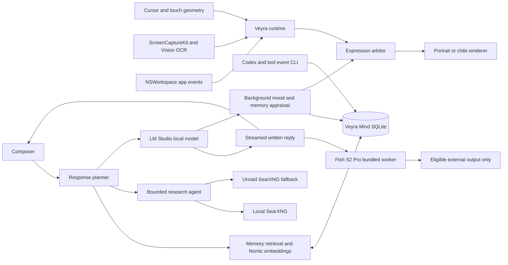

# Architecture and Implementation Plan

## System Flow

## Implemented Architecture

- `VeyraMindStore` is an actor owning one SQLite connection in WAL mode.
- Durable tables store messages, semantic memories, commitments, and 24-hour activity observations.
- `ResponsePlan.classify` chooses brief, normal, deep, creative, or research mode before inference.
- Visible prose streams first. Structured mood, memory, and commitment appraisal runs afterward.
- Nomic embeddings supplement lexical retrieval. Linear cosine search is intentional for a single-user database.
- `ResearchAgent` performs at most three search/evidence rounds and keeps at most eight sources.
- Immediate app events remain authoritative over model mood.
- Screen OCR runs at most every two seconds; capture is limited to one frame per second and excludes Veyra's windows and dedicated display.
- Foreground-app and CLI work events enter the same activity ledger used by conversation context.

## Bundled Speech Runtime

- TTS is enabled by default and reads only the final cleaned conversational line from the local text LLM.
- `SpeechPolicy` keeps a mixed-language line whole and chooses Arabic → Japanese → English for the anchor voice.
- The bundled Fish S2 Pro worker maps `EN-H`, `JA-B`, and `AR-O` to their selected anchor WAVs and synthesizes the whole line in one pass.
- Audio playback is allowed only when CoreAudio reports an eligible external output. Built-in routes, including MacBook Pro Speakers, always fail closed.
- The worker is bundled under `Contents/Resources/SpeechWorker`; the model weights and Python environment remain in their existing external caches.
- Measured cold warm is about 3.3–3.9 seconds; warmed short replies are about 2.6–5.8 seconds at roughly 0.6× real time.

## Response Budgets

| Mode | Normal behavior | Generation safety ceiling |
|---|---|---:|
| Brief | Greeting, acknowledgement, simple question | 384 |
| Normal | Ordinary conversation and coaching | 1,536 |
| Deep | Technical, résumé, review, substantial planning | 4,096 |
| Creative | Requested literary form and length | 8,192 |
| Research | Multi-round evidence synthesis | 8,192 |

These are safety ceilings, not target lengths. There is no universal 180-token cap.

## Remaining Phases

### Phase 1 — Live interface proof

- Packaged app installation and login startup are complete.
- Approve Screen Recording permission.
- Verify L01N8A exclusion, 0-point left margin, 15-point composer gap, streaming, Mind panel, and text sizing.
- Tune pat distance/speed only from physical use.

### Phase 2 — Model benchmark and routing

- Restore or download the chosen 35B-A3B candidates.
- Compare warm latency, decode speed, MTP acceptance, memory pressure, long-form quality, prompt copying, and research faithfulness.
- Keep one model warm if it satisfies both lanes; otherwise configure `VEYRA_DELIBERATE_MODEL` for deep, creative, and research work.

### Phase 3 — Awareness refinement

- Add a local vision-language digest only if OCR and app metadata measurably fail.
- Add explicit current-frame analysis for “what can you see?” without persisting the frame.
- Tune proactive interventions from real use; do not add more notification surfaces.

## Acceptance Gates

- All existing and new Swift tests pass.
- Release build passes without warnings.
- Identical event histories yield identical expression histories.
- Private URLs and filesystem paths are removed from generated search queries.
- SearXNG failover and HTML fallback work.
- Raw frames are absent from disk and outbound requests.
- Aim approves the physical display, personality, pat behavior, and selected model.
